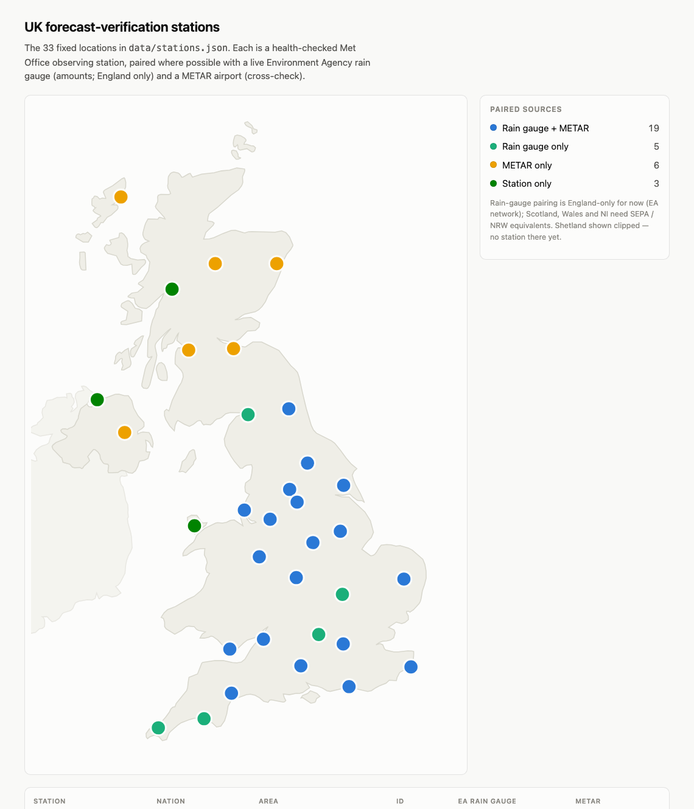

# weather-pred-quality

Which UK weather forecast should you actually trust? This project caches forecasts from
multiple free sources (Met Office, Open-Meteo's per-model feeds, met.no/Yr, …), verifies
them against station observations, and scores providers on accuracy *and* honesty
(probabilistic calibration) — segmented by region, lead time, and weather variable.

North star: a UK map serving calibrated probabilistic forecasts with
conformal-prediction-backed reliability guarantees.

## Status: collector live + first real metrics

[](docs/station-map.html)

*Interactive version: [`docs/station-map.html`](docs/station-map.html) (open locally —
hover for station details). Regenerate after registry changes with
`uv run scripts/make_station_map.py --screenshot`.*

- [`data/stations.json`](data/stations.json) — 33 health-checked verification locations
  (Met Office land-obs station + EA/SEPA/NRW rain gauge + METAR airport bundles)
- [`wpq/`](wpq/) — collector fetching UKMO forecasts + MOGREPS ensembles (via Open-Meteo),
  Met Office observations, EA/SEPA/NRW rain gauges and METARs into `data/raw/` as gzipped JSON,
  every 6 h via [GitHub Actions](.github/workflows/collect.yml) (ensembles ~2/day)
- [`scripts/backfill_ukmo.py`](scripts/backfill_ukmo.py) — one-off 2024→now backfill of
  lead-stratified UKMO forecasts + ERA5 truth; [`scripts/smoke_metrics.py`](scripts/smoke_metrics.py)
  sanity-checks skill-vs-lead on it
- [`wpq/normalize.py`](wpq/normalize.py) + [`wpq/metrics.py`](wpq/metrics.py) — raw JSON →
  tidy Parquet (`data/norm/`) → verification metrics (`data/metrics/metrics.parquet`):
  MAE/bias/RMSE, Brier, POD/FAR/CSI/ETS vs persistence + climatology baselines, rebuilt
  weekly by [CI](.github/workflows/metrics.yml). First findings:
  [`docs/results/2026-07-05-first-real-metrics.md`](docs/results/2026-07-05-first-real-metrics.md)
  — e.g. UKMO 10 m wind loses to day-of-year climatology beyond day 3
- [`wpq/calibration.py`](wpq/calibration.py) — split-conformal temperature intervals
  (90 % coverage held out-of-sample: ±1.5 °C day 0 → ±3.6 °C day 5), rain Brier
  decomposition (binary rain calls have *negative* skill vs climatology beyond day 1),
  block-bootstrap CIs: [`docs/results/2026-07-05-calibration.md`](docs/results/2026-07-05-calibration.md)
- [`scripts/make_weekly_report.py`](scripts/make_weekly_report.py) — Monday-morning
  red-amber-green health email (source liveness, station coverage, model-metric drift)
  via [weekly-report.yml](.github/workflows/weekly-report.yml), delivered as an
  instantly-closed `@`-mention issue; plus mid-week
  [`source-alert` issues](scripts/check_source_alerts.py) when a source is dead 24 h+

Documentation lives in [`docs/`](docs/README.md): start with
[`docs/overview.md`](docs/overview.md) (what this is and how the pipeline fits together),
then [data sources & ground truth](docs/data-sources.md),
[what's cached on disk and what every field means](docs/data-layout.md),
[how forecasts are scored](docs/methodology.md), and a
[glossary of every acronym](docs/glossary.md) (ERA5, UKMO, MOGREPS, ETS…).
Dated findings are in [`docs/results/`](docs/results/README.md); the research phase —
including every avenue considered but not (yet) pursued — is preserved in
[`docs/research/`](docs/research/README.md).

[`probes/`](probes/) contains small runnable scripts that verified the key APIs
(Open-Meteo multi-model / previous-runs / ensembles, met.no, NOAA METAR) with sample
payloads committed under `probes/samples/`.

```sh
uv sync
uv run probes/probe_open_meteo_forecast.py
```
